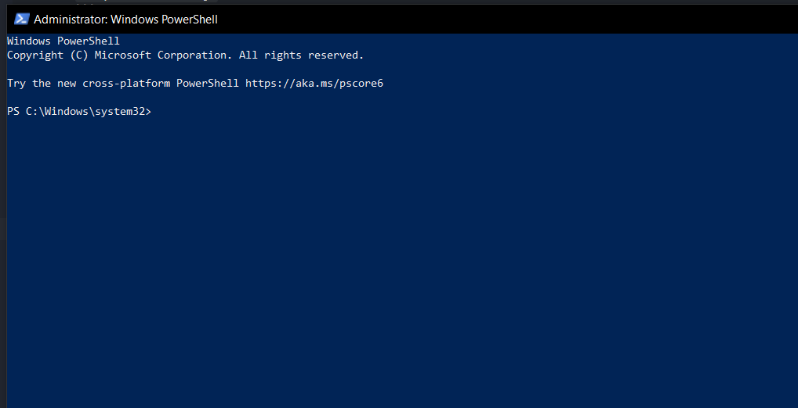

# 설치

## Windows

설치파일이 아니라 **커맨드**로 설치하는데 누구나 할 수 있게 간단하니 겁먹지 않으셔도 됩니다


### 1. **Windows** 검색창에 **Powershell** 을 치고 우클릭해서 **관리자의 권한으로 실행**

<p align="center">

</p>


### 2. 아래 **명령어**를 **복붙 엔터**해줍니다 (**node, npm 설치**)
아래 **명령어**들을 순서대로 **복붙 엔터**해줍니다
```bash
Set-ExecutionPolicy RemoteSigned -scope CurrentUser
iwr -useb get.scoop.sh | iex
scoop install nodejs
```

### 3. 아래 **명령어**를 **복붙 엔터**해줍니다 (**to-sptify 설치**)
```bash
npm i -g to-spotify
g2s help
m2s help
```
설치완료 간단!

프로그램 실행도 앞으로 이 커맨드창에서 전부 진행합니다


<br/>
<br/>

## Windows 이외의 운영체제
node, npm [설치](https://nodejs.org/ko/download/)하고 위 **커맨드**를 실행
