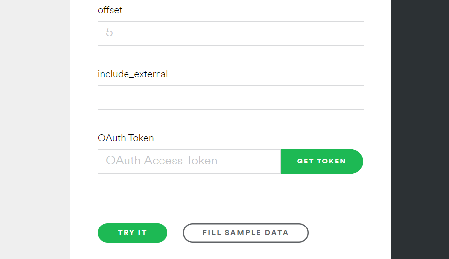

# 토큰 발급
Spotify에 재생목록이나 팔로우 등을 프로그램에서 추가하기 위한 인증 토큰을 발급받아야 합니다

## 발급 방법

### 1. [여기](https://developer.spotify.com/console/get-search-item/) 들어가기

### 2. Get Token 누르기

### 3. 아래와 같이 설정하고 토큰발급

### 4. 생성된 토큰 복사해서 어디 붙여놓기

### 주의사항
- 토큰이 아주 기니까 일부만 복사하지 말고 끝까지 복사하기
- 토큰 권한은 위 이미지처럼 해당 4개 권한을 필수적으로 줘야 작동
  - `playlist-modify-public`
  - `user-follow-modify`
  - `user-library-modify`
  - `playlist-modify-private`

