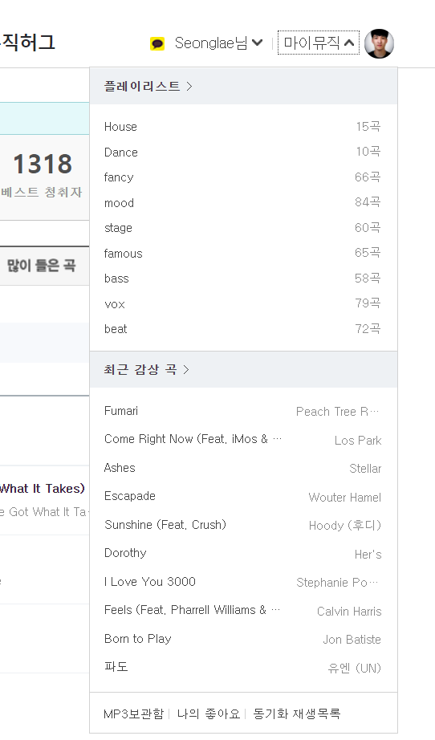

# 설치

## 필요한 아이디 확인

지니에서 플레이리스트나 좋아요 목록을 가져오기 위해 필요한 것이 있습니다

일반적인 아이디는 아니고 url에 있는 id가 필요함

### 1. 지니뮤직에 들어가서 로그인

마이 뮤직을 누르고 맨 아래에 나의 좋아요 버튼을 클릭

### 2. 리스트에서 2번째 페이지나 다른 페이지를 클릭합니다

아래 다른 페이지로 이동하면 url이 바뀜

### 3. URL 에 bgsq=blabla 부분을 기억합니다 

- &pg=4 앞까지 숫자

## 이전하기!

- [플레이리스트 옮기기](./playlist)
- [좋아요리스트 옮기기](./liked)