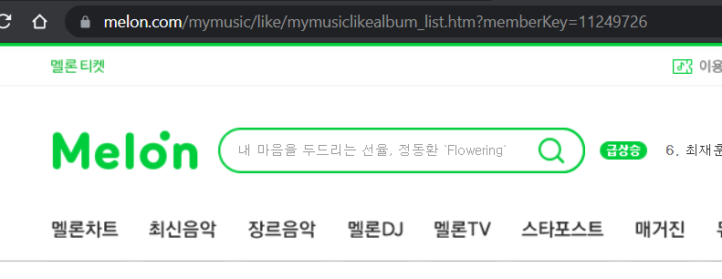

## 순서

### 1. 자기 프로필 들어가기
여기서 좋아요 곡이나 팬맺은 아티스트 리스트 클릭


### 2. URL 에서 memberKey 뒤에 오는 숫자 복사
앞으로 `memberKey`를 편의상 `mkey`라고 하겠슴



<br/>

### 3. 아래 커멘드들을 실행
URL에서 확인한 `mkey`와 **Spotify Token**가 필요함
순서대로 좋아요한 앨범, 음악, 팬맺은 아티스트들을 Spotify로 이전함

- 멜론 공개 프로필인지 체크하기

```bash
m2s liked albums --mkey blablanumber --stoken blablatoolong...
m2s liked tracks --mkey blablanumber --stoken blablatoolong...
m2s liked artists --mkey blablanumber --stoken blablatoolong...
```

<br/>

### 4. 이전완료!


