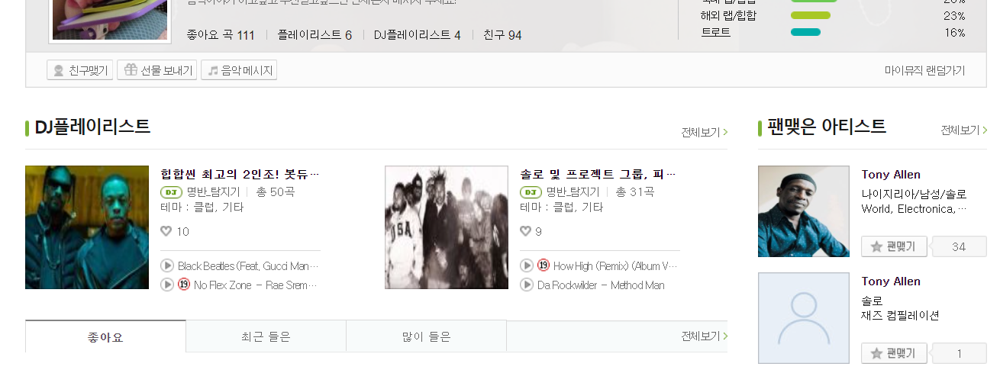
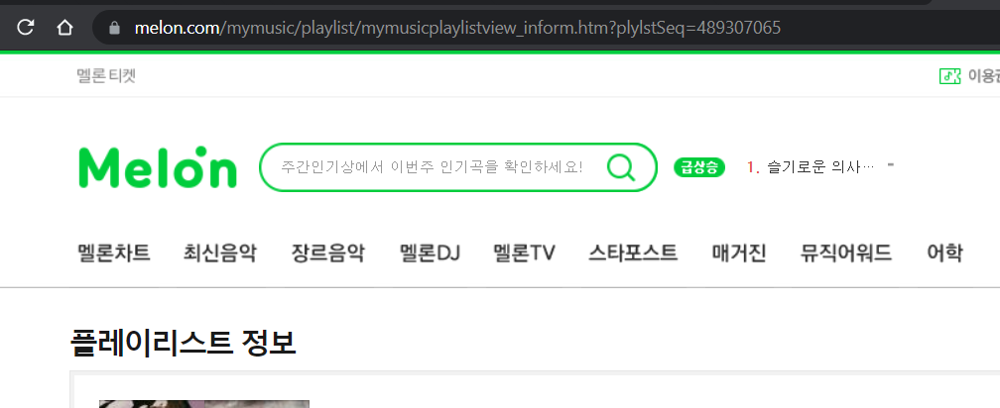

# 플레이리스트 옮기기

## 순서


### 1. 자기 프로필 들어가기
여기서 이전하고 싶은 플레이리스트 클릭




### 1. 플레이리스트 URL 아이디 찾기

플레이리스트를 들어가면 URL에 `plylstSeq`(`pseq`)=숫자를 복사해둡시다
- 공개된 플레이리스트가 아니라면 수정하기 눌러서 공개된 플레이리스트로 수정

<p align="center">

</p>

### 2. 프로그램 실행

기억해둔 `pseq`, 과**Spotify Token**으로 아래와 같이 커맨드를 치기
```zsh
m2s playlist --pseq blablanumber --stoken blablatoolong...
```

### 3. 이전완료!


