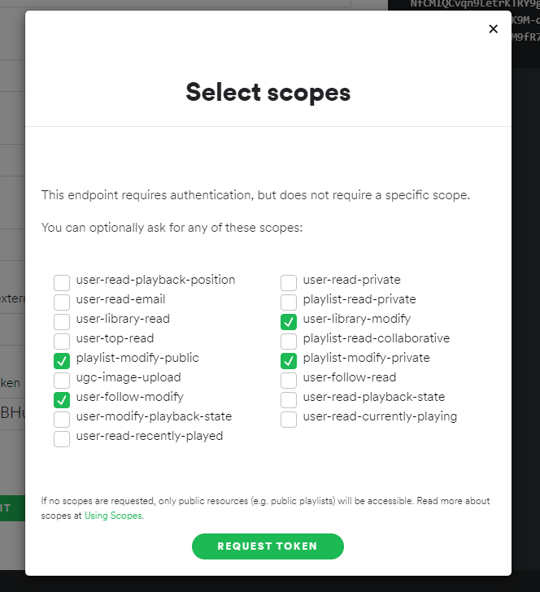
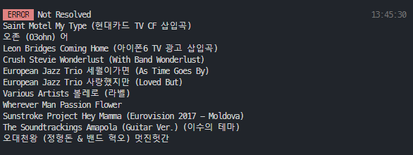

# Spotify에 인증할 토큰 발급

- [여기](https://developer.spotify.com/console/get-search-item/) 들어가기

Get Token 누르기

- 토큰이 아주 기니까 일부만 복사하지 않도록 조심
- 토큰 권한은 위와같이 줘야 기능이 정상적으로 작동

  

# 주의사항

검색 실패 아이템들이 리스트들이 아래처럼 커맨드창에 뜰텐데 해당 아이템들은 직접 넣어야 합니다 ㅠㅠ
